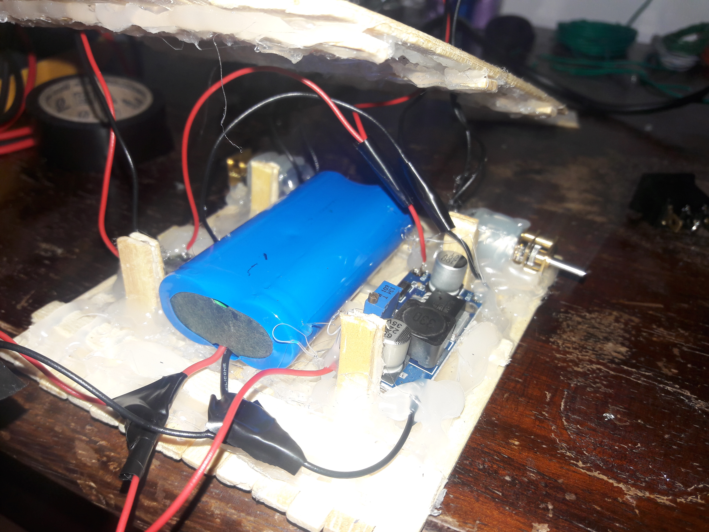
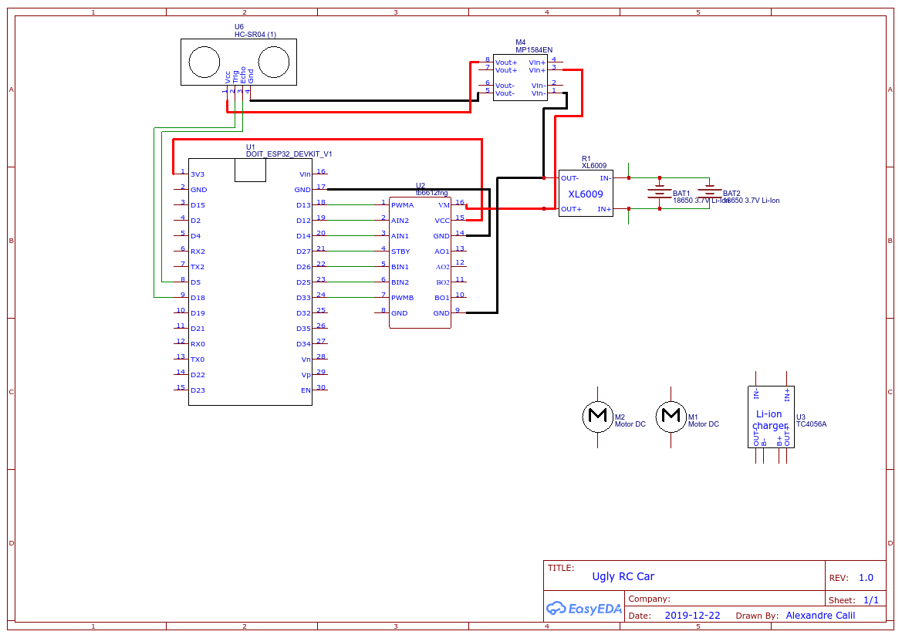

 

  <h3 align="center">Ugly RC Car</h3>
  

    A RC car with very bad mechanics (made with popsicle sticks), controlled by bluetooth.
     
     
    <a href="https://github.com/xandao-dev/ugly-rc-car"><strong>Explore the docs »</strong></a>
     
    <a href="https://github.com/xandao-dev/ugly-rc-car/issue">Report Bug</a>
    ·
    <a href="https://github.com/xandao-dev/ugly-rc-car/issues">Request Feature</a>
  

<!-- TABLE OF CONTENTS -->

  
Table of Contents

  <ol>
    <li>
      <a href="#about-the-project">About The Project</a>
      <ul>
        <li><a href="#features">Features</a></li>
        <li><a href="#built-with">Built With</a></li>
      </ul>
    </li>
    <li><a href="#roadmap">Roadmap</a></li>
    <li><a href="#contributing">Contributing</a></li>
    <li><a href="#license">License</a></li>
    <li><a href="#contact">Contact</a></li>
  </ol>

## About The Project

https://user-images.githubusercontent.com/22106326/188344255-bc4cc675-706a-4a01-8c2a-3af799afe14f.mp4

  

### Features

-   Control the car with a bluetooth controller

### Built With

-   [Arduino](https://www.arduino.cc/) - Arduino programming language
-   [ESP32 DevKit V1](https://www.espressif.com/en/products/socs/esp32) - Microcontroller
-   [2x N20 6V 500RPM](https://www.pololu.com/category/60/micro-metal-gearmotors) - DC Motor
-   [TB6612FNG](https://www.pololu.com/product/713) - Dual Motor Driver
-   [HC-SR04](https://www.sparkfun.com/products/15569) - Ultrasonic Sensor
-   [MP1584EN](https://www.amazon.com/MP1584EN-DC-DC-Converter-Adjustable-Module/dp/B01MQGMOKI) - Voltage Regulator
-   [XL6009](https://components101.com/modules/xl6009-dc-dc-step-down-voltage-regulator-module) - DC Boost Converter
-   [SD 18650](https://www.amazon.com/18650-battery/s?k=18650+battery) - 4.2V 8800mAh Battery
-   [TC4056A](https://www.addicore.com/TP4056-Charger-and-Protection-Module-p/ad310.htm) - Charger Module

## Roadmap

See the [open issues](https://github.com/xandao-dev/ugly-rc-car/issues) for a list of proposed features (and known issues).

## Contributing

Contributions are what make the open source community such an amazing place to be learn, inspire, and create. Any contributions you make are **greatly appreciated**.

1. Fork the Project
2. Create your Feature Branch (`git checkout -b feature/AmazingFeature`)
3. Commit your Changes (`git commit -m 'Add some AmazingFeature'`)
4. Push to the Branch (`git push origin feature/AmazingFeature`)
5. Open a Pull Request

## License

Distributed under the MIT License. See [LICENSE](./LICENSE.md) for more information.

Free software =)

## Contact

Alexandre Calil - [Linkedin](https://www.linkedin.com/in/xandao-dev/) - [alexandre@xandao.dev](mailto:alexandre@xandao.dev)

Project Link: [https://github.com/xandao-dev/ugly-rc-car](https://github.com/xandao-dev/ugly-rc-car)
